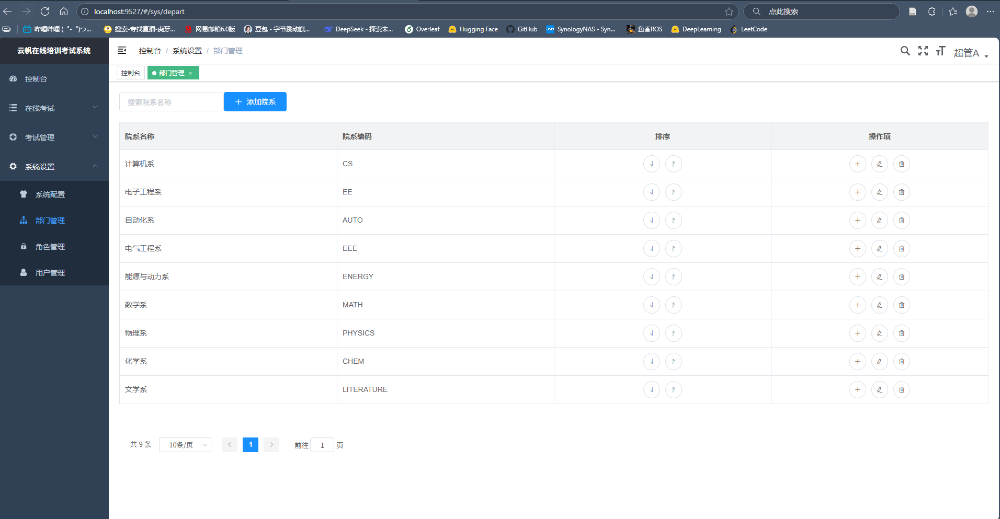
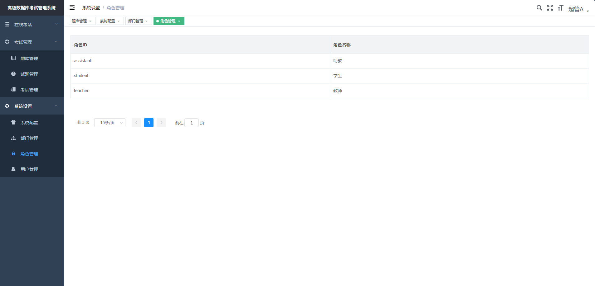
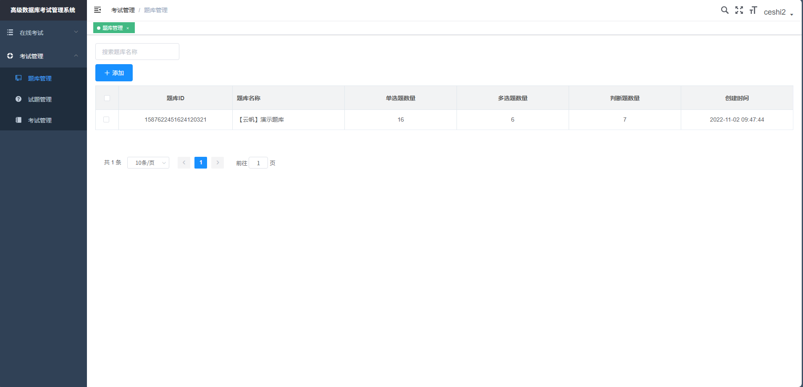
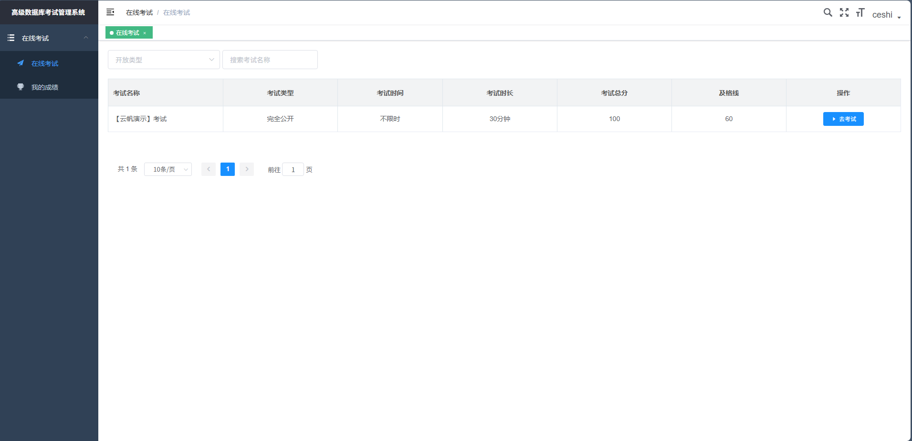
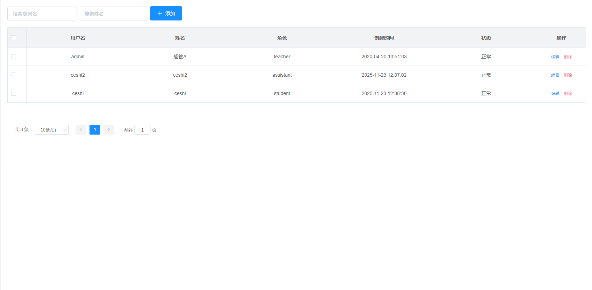

# System部分修订内容

# 部门管理部分

修改原始的部门类别为相应的学科系别，包括


| id                  | dept_type | parent_id | dept_code  | sort | faculty_name | category |
| ------------------- | --------- | --------- | ---------- | ---- | ------------ | -------- |
| 1302853644578000898 | 1         | 0         | CS         | 1    | 计算机系     | FACULTY  |
| 1302855940200284161 | 1         | 0         | EE         | 2    | 电子工程系   | FACULTY  |
| 1302855994843676674 | 1         | 0         | AUTO       | 3    | 自动化系     | FACULTY  |
| 1302856017283203073 | 1         | 0         | EEE        | 4    | 电气工程系   | FACULTY  |
| 1302856084475953154 | 1         | 0         | ENERGY     | 5    | 能源与动力系 | FACULTY  |
| 1302856266567467010 | 1         | 0         | MATH       | 6    | 数学系       | FACULTY  |
| 1302856320602685442 | 1         | 0         | PHYSICS    | 7    | 物理系       | FACULTY  |
| 1318103313740320770 | 1         | 0         | CHEM       | 8    | 化学系       | FACULTY  |
| 1318103339229106178 | 1         | 0         | LITERATURE | 9    | 文学系       | FACULTY  |

演示效果



# 删除了控制台部分的内容

控制台内容包括一些广告，所以对其进行了删除隐藏

# 修改用户身份种类

修改原有的身份种类为teacher，assistant和student

teacher拥有考试，试卷管理和系统用管理权限，assistant拥有考试和试卷管理权限，student拥有考试权限








# 增加用户的删除和修改功能

在原有的增加用户的基础上增加了修改用户信息和删除用户的功能



# 工程文件运行方式

    # 启动后端
    cd d:\26303\Documents\Github\exam-system\exam-api
    # 设置 active profile 为 local，并让 Spring 加载当前目录下的 config 文件夹
    mvn -Dspring-boot.run.profiles=local -Dspring-boot.run.jvmArguments="-Dspring.config.additional-location=./param/" spring-boot:run

    # 启动前端
    cd d:\26303\Documents\Github\exam-system\exam-vue
    npm install
    npm run dev


    ### 使用 `.env` 启动后端（可选）

    如果你希望通过仓库根的 `.env` 文件注入敏感配置（例如数据库密码），本工程在后端实现了自动加载 `.env` 的支持。

    - 将你的私密变量写到仓库根的 `.env`（该文件已被 `.gitignore` 忽略）：

    ```text
    # 示例 .env（不要提交真实值）
    DB_HOST=114.214.236.207
    DB_PORT=13306
    DB_NAME=yunfan
    DB_USER=yf
    DB_PASSWORD=your_password_here
    LOG_PATH=D:\logs\yunfan\
    ```

    - 启动方式（PowerShell 示例）：

    1) 在仓库根以 `-f` 指定 pom 运行（推荐，`.env` 将被正确读取）：

    ```powershell
    Set-Location D:\26303\Documents\Github\exam-system
    mvn -f .\exam-api\pom.xml -Dspring-boot.run.profiles=local -Dspring-boot.run.jvmArguments="-Dspring.config.additional-location=./exam-api/param/" spring-boot:run
    ```

    2) 或把 `.env` 放在 `exam-api` 目录下并在该目录运行（等价效果）：

    ```powershell
    Set-Location D:\26303\Documents\Github\exam-system\exam-api
    # 确保 exam-api\.env 存在
    mvn -Dspring-boot.run.profiles=local -Dspring-boot.run.jvmArguments="-Dspring.config.additional-location=./param/" spring-boot:run
    ```

    - 以打包后的 jar 运行时：请把 `.env` 放在运行目录或把变量导出到系统环境，然后运行 jar：

    ```powershell
    # 将 .env 中的变量导入当前 PowerShell 会话（示例）
    Get-Content .\.env | ForEach-Object {
        if ($_ -and -not $_.StartsWith('#')) {
            $p = $_ -split '=', 2
            if ($p.Length -eq 2) { $env:$($p[0].Trim()) = $p[1].Trim() }
        }
    }

    # 然后运行 jar（示例路径为 ignore 目录下的 Maven 输出）
    java -jar .\ignore\exam-api-target\exam-api.jar
    ```

    注意：
    - `.env` 仅供本地/开发使用，**不要**将真实密钥提交到远程仓库。仓库中已有 `.env.example` 供参考。
    - 我们实现的 `.env` 加载器会优先保留系统环境或命令行传入的值；如需覆盖系统环境，请事先确认风险。
